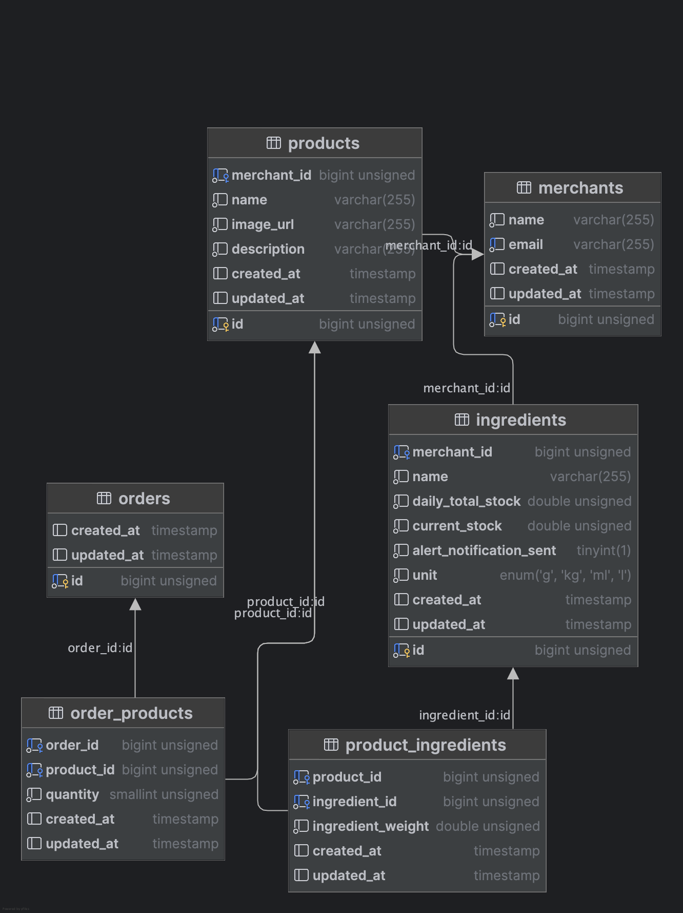

<p align="center"><a href="https://laravel.com" target="_blank"></a></p>

<p align="center">
<a href="https://github.com/laravel/framework/actions"></a>
<a href="https://packagist.org/packages/laravel/framework"></a>
<a href="https://packagist.org/packages/laravel/framework"></a>
<a href="https://packagist.org/packages/laravel/framework"></a>
</p>

## Installation Guide For Foodics Task

- Install PHP 8.3 or higher
- Install Composer
- Clone the repository using the following command:
   - ``` git clone https://github.com/mohamedFatehy/foodics.git```
- Go to inside the project directory using the following command:
   - ``` cd foodics```
- Install the project dependencies using the following command:
   - ``` composer install```
- In the composer install step the `.env` file will be created from the `.env.example` file, you can change the database configuration in the `.env` file and the ports as you like to not conflict with your local ports.
- Run the Helper commands in the make file to create the database and run the migrations and seed the database and serve the project using the following command:
   - ``` make start```  and keep it running in the Terminal or if  you faced an issue run ```make fresh``` 
- This project requires the following ports to be free:
    - 8000 for serving the project
    - 3306 for the database
    - 8025 for the mailing server
- To make the Queue work you need to run the following command and Keep it running in another Terminal:
   - ```make queue```
- To be able to View the Sent Emails you can need to open that webpage:
   - <a href="http://localhost:8025/">Open Mail</a>
- To Run the Tests you can run the following command:
   - ```make test```
- Finally to stop the project you can run the following command:
   - ```make down```
- open postman and import this collection from the root of the project `Foodics.postman_collection.json` and start testing the APIs.:
   - Inside this collection you will find the create order ApI 
  

## Project Structure

- The project is built using **Laravel** 11.9 and **php** 8.3 and **mysql** 8.0 and **mailpit** for the mailing server.
- The project is built using the MVC design pattern and service oriented architecture and the repository pattern.
- The project is built using the Laravel Queues to send the emails.
- The Project is Built Containerized using Docker and controlled using Laravel/Sail Package.
- The Project using Seeder to Seed Data to the Database and the Seeder is located in the `database/seeders` directory. that contains
   - 1 Merchant
   - 3 ingredients as mentioned in the task
   - 2 product that contains the 3 ingredients

## Database Design


## API Endpoints

- create order API
    - This API is used to create a new order and if the one ingredient reached less than 50% of the daily stock an email will be sent to the merchant to notify him about the stock shortage.
    - The API is a POST request to the following endpoint:
        - ```/api/orders```
    - The API requires the following parameters:
        - `products` : the items of the order in the following format:
            - ```json
                [
                    {
                        "product_id": 1,
                        "quantity": 2
                    }
                ]
              ```
        - The API will return the following response:
          - ```json
                 {
                    "success": true,
                    "message": "order created",
                    "data": []
                 }


## License

This Project is under [MIT license](https://opensource.org/licenses/MIT).
